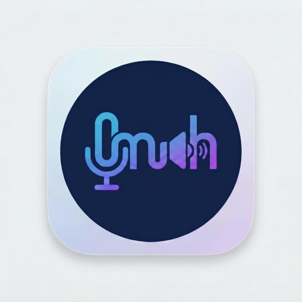

<p align="center">
  
</p>

<h1 align="center">Look Ma No Hands</h1>

<p align="center">
  System-wide dictation and text-to-speech for macOS, locally run open-source models, entirely on your Mac.
</p>

<p align="center">
  
  
  <a href="LICENSE"></a>
  <a href="https://github.com/j0elmiller/lmnh/actions/workflows/build.yml"></a>
  <a href="https://www.buymeacoffee.com/lmnh"></a>
</p>

---

A native macOS menu bar app that replaces cloud-based dictation and text-to-speech services with open-source models running 100% on-device. No subscriptions, no data leaving your Mac.

## Features

- **Speech-to-Text**: Press `Option + Space` to dictate anywhere. Your speech is transcribed locally using [WhisperKit](https://github.com/argmaxinc/WhisperKit) and injected at the cursor, similar to wispr.
- **Text-to-Speech**: Select text in any app and press `Option + S` to hear it read aloud using on-device TTS, similar to speechify.
- **Fully Local**: All models run on Apple Silicon via CoreML. Nothing is sent to the cloud.
- **System-Wide**: Works in any app with global hotkeys that are configurable and text injection.

## Requirements

- macOS 15.0+
- Apple Silicon Mac

## Install

### Download the DMG (recommended for most users)

1. Grab the latest `.dmg` from [**Releases**](https://github.com/j0elmiller/lmnh/releases/latest).
2. Mount it and drag **Look Ma No Hands** into your Applications folder.
3. On first launch, right-click the app → **Open** → **Open** in the Gatekeeper dialog. The app is ad-hoc signed rather than Apple-notarized, so macOS asks you to confirm you trust it. [INSTALL.md](INSTALL.md) (also included inside the DMG) has the full Gatekeeper walkthrough if anything goes sideways.

### Build from source

```bash
git clone git@github.com:j0elmiller/lmnh.git
cd lmnh
xcodebuild -project LookMaNoHands.xcodeproj -scheme LookMaNoHands -configuration Debug
```

The `.xcodeproj` is committed, so this works from a fresh clone. If you edit `project.yml` or your project gets into a weird state, regenerate it:

```bash
brew install xcodegen
xcodegen generate
```

Building a release DMG additionally needs pre-staged models and a couple of Homebrew tools; see [CONTRIBUTING.md](CONTRIBUTING.md#preparing-models-for-release-builds).

## First launch

The onboarding wizard will walk you through:

- Granting **microphone** permission
- Enabling **accessibility** access in System Settings
- Downloading the speech models (~150 MB — the DMG ships with models bundled, but source builds fetch them on first launch)

## Usage

| Shortcut | Action |
|---|---|
| `Option + Space` | Toggle dictation (speak to type) |
| `Option + S` | Read selected text aloud |

Keep an eye on the menu bar icon — it's a simplified `mnh` monogram (mic on the left, speaker on the right). The mic stays the same across all states; the speaker side and any accent marks change to show what the app is doing, so you can tell state at a glance without opening the popover:

| Icon | State | What it means |
|---|---|---|
|  | **Idle** | Ready to go. Models are loaded and both mic + accessibility permissions are granted. |
|  | **Recording** | Actively capturing mic audio. Start speaking, then press `Option + Space` again to stop (or release in push-to-talk mode). |
|  | **Transcribing** | Recording stopped; WhisperKit is converting audio into text and injecting it at the cursor. |
|  | **Speaking** | Reading selected text aloud via TTS. Press `Option + S` again to stop. |
|  | **Warning** | A required permission is missing (microphone or accessibility). Open the popover and re-run onboarding or the relevant System Settings pane to resolve. |

The icons are rendered as template images, so macOS tints them to match your menu bar (light, dark, or Reduce Transparency).

## Architecture

Pure Swift/SwiftUI menu bar app with three dependencies:

| Dependency | Purpose |
|---|---|
| [WhisperKit](https://github.com/argmaxinc/WhisperKit) | On-device speech-to-text (Whisper via CoreML) |
| [TTSKit](https://github.com/argmaxinc/WhisperKit) | On-device text-to-speech |
| [KeyboardShortcuts](https://github.com/sindresorhus/KeyboardShortcuts) | Global hotkey registration |

```
LookMaNoHands/
  App/
    LookMaNoHandsApp.swift    # @main, MenuBarExtra
    AppState.swift             # Central @Observable state
  Services/
    Audio/AudioRecorder.swift  # AVAudioEngine mic capture
    STT/TranscriptionEngine.swift
    TTS/SpeechEngine.swift
    System/
      TextInjector.swift       # AX + clipboard text injection
      TextSelector.swift       # AX selected text extraction
      PermissionManager.swift  # Mic + accessibility checks
  UI/
    MenuBarView.swift          # Menu bar dropdown
    OnboardingView.swift       # First-launch wizard
    RecordingOverlay.swift     # Floating pill during dictation
    SettingsView.swift         # Preferences window
```

## Contributing

Contributions are welcome. Start with [CONTRIBUTING.md](CONTRIBUTING.md) for the dev setup, project layout, and PR expectations. Bug reports and feature requests go through the [issue templates](https://github.com/j0elmiller/lmnh/issues/new/choose); vulnerabilities go through [private reporting](https://github.com/j0elmiller/lmnh/security/advisories/new) per [SECURITY.md](SECURITY.md).

All participation is governed by our [Code of Conduct](CODE_OF_CONDUCT.md).

## Support

If this app saves you the cost of a Wispr/Speechify subscription and you'd like to toss a few bucks my way, I'd appreciate it, but it's entirely optional. The app is and will stay free and open-source.

<p align="center">
  <a href="https://www.buymeacoffee.com/lmnh"></a>
</p>

## License

[MIT](LICENSE)
